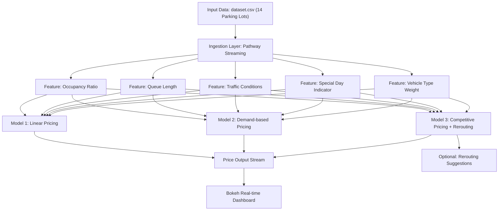

# 📊 Project Architecture Diagram – Dynamic Pricing for Urban Parking Lots

**Capstone Project – Summer Analytics 2025**  
**Consulting & Analytics Club × Pathway**

---

## 📝 Overview

This document illustrates the architecture and workflow of the **Dynamic Pricing for Urban Parking Lots** project.  
It shows how real-time data is ingested, processed, and used to generate intelligent pricing decisions for each parking lot.

The system provides:
✅ Real-time pricing updates  
✅ Smooth and explainable price adjustments  
✅ Optional rerouting recommendations

---

## 📐 Architecture Diagram

---

## 🔄 Workflow Stages

### 1️⃣ Input Data
- Historical dataset of 18,368 records.
- Includes: timestamp, occupancy, capacity, queue length, vehicle type, special day indicator, and location coordinates.

### 2️⃣ Ingestion Layer
- Simulates real-time streaming of data using **Pathway**.
- Preserves timestamp order for realistic simulation.

### 3️⃣ Feature Engineering
- Computes live features:
  - Occupancy rate (`occupancy/capacity`)
  - Queue length
  - Traffic conditions mapped to numeric weights
  - Special day indicator
  - Vehicle type weight

### 4️⃣ Pricing Engine
- Three progressive models:
  - **Model 1: Linear Pricing**
    - Price increases linearly with occupancy.
  - **Model 2: Demand-based Pricing**
    - Combines weighted features into a demand score.
  - **Model 3: Competitive Pricing**
    - Considers competitor proximity and prices, optionally suggests rerouting.

### 5️⃣ Output & Visualization
- Real-time price streams for each parking lot.
- Interactive dashboard using **Bokeh** to monitor pricing behavior.
- Optional rerouting recommendations when lots are overburdened.

---

## 🧾 Notes & Assumptions

- Price is bounded between **$5 and $20** for realistic behavior.
- Base price starts at **$10**.
- Competitor proximity is computed using geographic distance.
- Real-time simulation is demonstration-only — production requires live IoT feed.

---

✅ This architecture ensures:
- Real-time performance
- Scalability to more parking lots
- Explainable and smooth pricing decisions
- Integration with monitoring dashboards
